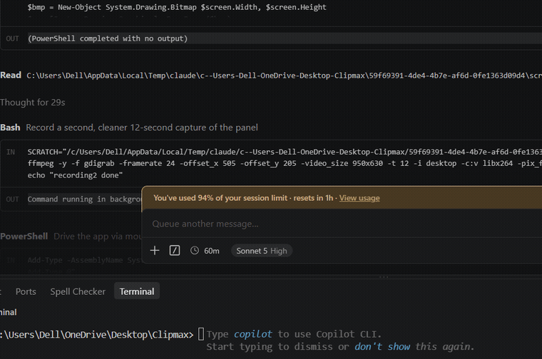

# Stash

Tray-resident clipboard manager and note-taking app. Local only — the codebase
makes no network calls, and no dependency that opens a socket is included.

v0.1 is the vertical slice described in [PLAN.md](PLAN.md): capture, search,
notes, and the window behaviour that makes it usable from the keyboard.

## Demo



Arrowing through a stored credential, a note, a link and two code snippets;
`Ctrl+T` on a JSON clip for the "paste as" menu; then the search box, first with
the `type:code` operator and then as a plain prefix search. The same recording at
full resolution is at [docs/media/demo.mp4](docs/media/demo.mp4). Data shown is
seeded demo content, not a real clipboard history.

## Building

```bash
npm install
npm run tauri dev
```

Requires Rust (stable-msvc on Windows) and, on Windows, the VS Build Tools C++
workload plus a Windows SDK.

**Build artifacts live outside the repo.** `src-tauri/.cargo/config.toml` points
`target-dir` at `D:/stash-build-target`. Two reasons, both learned
the hard way: this project sits in a OneDrive-synced folder, and OneDrive's
on-demand file virtualisation intermittently makes build-script `OUT_DIR`s
non-writable (`indexmap` fails with "output path is not a writable directory");
and a debug build is ~1.8 GB, which has no business syncing to the cloud.

The dev profile also gives dependencies no debug info (`[profile.dev.package."*"]`)
because a full-symbol debug build exhausted the disk. Our own code keeps
`line-tables-only`, so panics still carry file and line numbers. If you need to
step into a dependency, set `debug = true` there and expect the space back.

| Command | What it checks |
|---|---|
| `npm run check` | `tsc --noEmit` over the frontend |
| `cargo check` (in `src-tauri/`) | the backend |
| `cargo test` (in `src-tauri/`) | classifier, query parser, transforms, crypto, migrations, export/import |

## Using it

| Key | Action |
|---|---|
| `Ctrl+Shift+V` / `Cmd+Shift+V` | show or hide the panel, from anywhere |
| `↑` / `↓` | move the selection |
| `Enter` | paste the selected item into the window you came from |
| `Ctrl+Enter` | copy it to the clipboard without pasting |
| `Ctrl+T` | "paste as" — transform the selection on the way out |
| `Ctrl+Backspace` | delete the selected item |
| `Ctrl+P` | pin or unpin |
| `Ctrl+N` | new note |
| `Ctrl+K` | new credential |
| `Ctrl+Shift+C` | copy the selected credential's password |
| `Alt+1`…`9` | filter by folder (`Alt+0` clears) |
| `Ctrl+,` | settings |
| `Esc` | hide the panel |

Clicking away hides the panel. Closing the window hides it too — the tray menu's
**Quit** is the only thing that ends the process.

## Searching

An empty box lists everything, recent first. Typing runs an FTS5 prefix search.
Beyond that the box understands operators:

```
app:Code type:code is:pinned folder:work sort:used "exact phrase"
```

| Operator | Effect |
|---|---|
| `type:` `t:` | content type, or a chip name — `link` `text` `image` `code` `cred` |
| `app:` | source application |
| `folder:` `f:` | folder by name, case-insensitively |
| `is:` | `pinned` `note` `clip` `credential` `unfiled` |
| `sort:used` | rank by how often you have used the item, not by recency |
| `"…"` | a phrase, kept together |

Repeating an operator ORs within it and ANDs across it — the same rule the
filter chips follow, because they compile to the same `Filters` struct. There is
one filtering path, not two.

Two things it deliberately does *not* do. An unknown operator is not an error:
`wat:huh` searches for that text, so a typo finds nothing surprising rather than
silently matching everything. And a pasted `https://example.com` is not read as
an `https:` operator — the parser hands anything it does not recognise straight
back as text, which is the case the test suite guards hardest.

The parser is in `src/query.rs` and is pure: names are resolved to ids in SQL, so
it never touches the database. `commands::search_items` is the only caller.

## Transforming on the way out

`Ctrl+T` opens a "paste as" menu for the selected item: prettify or minify JSON,
base64 and URL encode/decode, upper/lower/Title/snake/kebab case, trim, join
lines. Enter pastes the result, `Ctrl+Enter` copies it.

**The stored item never changes.** A transform rewrites only what reaches the
clipboard for that one paste; the history keeps what you actually copied.

The menu is built per item by `transforms_for`, which decides by *trying* rather
than guessing: Prettify appears only if the content really parses as JSON, and
Decode only if the content really is decodable base64 that yields valid UTF-8.
Offering Decode on ordinary prose would produce mojibake and read as a bug, so
`looks_like_base64` insists on length, alphabet and a successful decode, and
rejects all-alphabetic strings outright.

JSON key order survives the round trip. `serde_json` sorts object keys by
default, which would silently reorder a config you were about to paste back, so
the crate is built with `preserve_order`.

Base64 and percent-encoding are hand-rolled in `src/transform.rs` rather than
pulled in as crates — a few lines each, in a project that already hand-rolls its
DIB decoding, and one fewer dependency in a tree whose selling point is what is
*not* in it.

## Usage-aware ranking

`items.use_count` counts the times an item was copied or pasted *out* of Stash,
and `sort:used` ranks by it. This is not `updated_at`: that column moves every
time the watcher sees the same content again, so copying something once a day
and reaching for a stored snippet forty times look identical through it.

Recording a use deliberately does not touch `updated_at`. Bumping it would
reshuffle the recent-first list every time you copied something, which is the
opposite of what a history is for — there is a test for exactly that.

## Getting your data out

Stash holds the only copy of your credentials, and DPAPI seals them to one
Windows account -- so `stash.db` is unreadable on the machine you would be
migrating *to*. That is what makes an export path a requirement rather than a
nicety, and why the encrypted format uses a passphrase instead of DPAPI.

Settings -> **Backup and restore**. Three formats:

| Format | Contains | Re-importable |
|---|---|---|
| Encrypted backup (`.stashbk`) | everything, passwords included, sealed with a passphrase | yes |
| JSON | everything; passwords only if you tick the box | yes |
| Markdown | readable notes, clips and credential fields | no |

Markdown never carries a password, whatever the settings say: it exists to be
read, printed and pasted, and a password in it ends up somewhere it was not
meant to be. An encrypted backup always carries them, because a
passphrase-protected archive without the credentials would not answer the
question it exists for.

The archive shape is deliberately not the database schema. There are no ids --
they mean nothing in another database and only invite primary-key collisions.
Folders travel by name. Images are inlined as base64 so one file is the whole
archive; a blob path into an app-data directory that will not exist is not a
backup.

**Importing merges. It never deletes or overwrites.** Items already present are
skipped -- clips by hash, and notes and credentials by an exact match on type,
title, content and `created_at`, since those are stored with no hash. Without
that second half, restoring the same backup twice would silently duplicate every
note you own. Imported passwords are re-sealed with *this* machine's key rather
than carried across.

Crypto is the one place this project does not hand-roll its primitives:
Argon2id derives the key, AES-256-GCM seals the bytes, and the salt and nonce
are fresh per archive. A wrong passphrase and a damaged file are indistinguishable
to GCM, so the error says both rather than guessing.

## Pasting, not just copying

`Enter` puts the item on the clipboard, hides the panel, hands focus back to
whatever window was focused when you opened it, and sends `Ctrl+V`. The window
to return to is recorded in `window::show`, before the panel appears — once the
panel has focus, the window you wanted is no longer the foreground one.

Nothing about that is assumed to have worked. The keystroke is only sent after
`GetForegroundWindow` confirms the target really is in front; if it never gets
there, or `SendInput` is refused (an elevated window will not accept synthetic
input from an unelevated process), the panel reports it and the item is still on
your clipboard to paste by hand. `Ctrl+Enter` skips the paste deliberately, and
the settings toggle turns it off altogether.

**Windows only.** macOS could do this with a Cmd+V `CGEvent` and Linux with
XTEST on X11, but synthetic keystrokes land in *other people's applications* —
a different risk from the written-but-unrun pasteboard code elsewhere in this
tree — and Wayland forbids it outright. Both return "unsupported" with a reason
the settings panel shows, and `Enter` falls back to copying.

Credential usernames paste the same way. Passwords do not: the field that had
focus before the panel opened is not reliably the password field, and a password
typed into the wrong one is not a mistake you can take back.

## How it stays quiet when idle

The watcher polls every 400ms, but a tick where nothing was copied costs one
platform call and an integer compare:

- **Windows** — `GetClipboardSequenceNumber`. The clipboard is not opened at all
  unless the counter moved.
- **macOS** — `NSPasteboard.changeCount`.
- **Linux** — no such counter exists, so this is the one platform that reads the
  selection each tick and compares a hash. XFIXES `SelectionNotify` would make
  it event-driven; that is the v0.2 follow-up.

Nothing is sent to the frontend on an unchanged clipboard, so React does not
re-render and no query runs. Re-copying something already stored bumps its
`updated_at` instead of inserting a duplicate row.

## What is never recorded

Content the copying app marked as secret is skipped before any bytes are read:

- **Windows** — the `ExcludeClipboardContentFromMonitorProcessing` clipboard
  format, which password managers set.
- **macOS** — `org.nspasteboard.ConcealedType`, plus the transient and
  auto-generated markers.
- **Linux** — **not available.** There is no portable marker; the KDE convention
  (`x-kde-passwordManagerHint`) needs raw X11 TARGETS inspection that `arboard`
  does not expose. On Linux, password-manager copies *will* be recorded. This is
  logged as a warning at startup and is the main known gap in v0.1.

Images over 10MB are skipped. The first clipboard state after launch is used as
a baseline and never stored, so whatever happened to be on the clipboard before
you started Stash is not swept up.

## Screen-capture exclusion

On by default, toggleable in settings. The settings toggle reports what the
platform actually did rather than assuming it worked.

- **Windows** — `SetWindowDisplayAffinity(hwnd, WDA_EXCLUDEFROMCAPTURE)`. That
  flag needs Windows 10 build 19041; on older builds the call is rejected and
  Stash falls back to `WDA_MONITOR`, which blanks the panel in recordings rather
  than hiding it. The settings panel says so when this happens.
- **macOS** — `NSWindow.sharingType = NSWindowSharingNone`.
- **Linux** — unsupported. A compositor decides what a screencast sees and there
  is no client-side opt-out, so hide-on-blur is the only mitigation. Warned once
  at startup.

## What was verified on Windows 11

Checked by running the app, not by reading the code:

| Behaviour | Result |
|---|---|
| Seven content types classified on insert | url, email, json, hex_color, code, path, text — all correct |
| `source_app` capture | recorded the focused app's executable stem |
| Concealed clipboard skipped | wrote a clip flagged `ExcludeClipboardContentFromMonitorProcessing`; item count unchanged, no row contains the secret |
| Dedupe by hash | re-copying an existing clip left one row with `updated_at` bumped |
| Image capture | CF_DIB converted to PNG, sharded blob on disk, hash stored |
| Idle CPU | **0.000%** over 30s across ~75 poll ticks, 31.8 MB resident |
| Capture exclusion | `GetWindowDisplayAffinity` returns `0x11` (`WDA_EXCLUDEFROMCAPTURE`, not the degraded fallback); a screen capture taken while the window was verifiably visible contains no trace of it |
| Global shortcut | Ctrl+Shift+V shows and hides the panel |
| Hide on blur | panel hides within ~100ms of losing focus |
| FTS5 search | a query narrowed 9 items to the 2 matching rows, ranked |
| Notes | Ctrl+N, edit, Ctrl+S persists `kind='note'`, `content_type='markdown'`, title derived from the first line |
| Paste on Enter | copied one string, buried it under a decoy, opened the panel from a plain Win32 window, searched, pressed Enter — the **searched** string arrived in that window, so Stash both replaced the clipboard and delivered the keystroke |
| `Ctrl+Enter` | same sequence: clipboard updated, target window untouched |
| DPAPI at rest | the live database's `item_secrets` rows all read `enc='dpapi.v1'` with no plaintext in the column, and the blobs decrypt through `[System.Security.Cryptography.ProtectedData]` — a different implementation than the one that wrote them |
| Upgrade pass | ran against the real database; both existing credentials re-sealed and still return their original passwords |
| Password auto-clear | clipboard held the password at t+20s and was empty at t+34s; repeating it and copying something else at t+12s left that something else intact at t+34s |
| Launch on startup | toggling it wrote `HKCU\…\Run\Stash`, untoggling removed it; starting with the setting false and the key present, startup reconcile removed the key |
| Idle CPU | **0.02%** over 30s with the panel hidden, 31.1 MB resident — unchanged by any of the above |
| Query operators filter | `app:Code zebra` pasted the clip (as free text `app:Code` could never match), and `app:brave zebra` pasted nothing though the text alone matches — so the operator both includes and excludes |
| Operators leave the text alone | `is:clip zebra` still found the item; had `is:clip` reached FTS, the AND would have matched nothing |
| Transform | `Ctrl+T` → Prettify on a one-line JSON clip pasted it across seven lines, with `zebra` still ahead of `apple` — proving `preserve_order` rather than alphabetical sorting |
| Usage ranking | two clips sharing a term: plain search pasted the newer, three uses later `sort:used` pasted the older, and the plain search still pasted the newer |

| Encrypted export | driven through the settings panel and the native save dialog: wrote a 24,270-byte `.stashbk` beginning `STASHBK1`, containing none of `Daily Marble`, `vnathan`, `David` or `stash-export` as readable bytes |
| Hide-on-blur guard | the panel was still up behind both the save and the open dialog; without `window::HideGuard` the picker's focus grab would have dismissed it mid-export |
| Import is idempotent | importing that backup into the database it came from reported **"Imported 0 items · 25 already here"** — including the notes and credentials, which carry no hash and are matched on exact content |

Verified by the test suite rather than by hand: the JSON and Markdown formats,
and a full export/import round trip into a *separate* database carrying a sealed
password, a real image blob, folder membership, pin state and timestamps.

The paste harness asserts that the target window really holds focus before
pressing the shortcut. Without that check an empty target reads as "did not
paste" when the truth may be "pasted into something else", and the first run of
these Tier 2 checks produced exactly that false negative.

Not verified: macOS and Linux (written, `cfg`-gated, never compiled on those
platforms), and retention pruning at the 1000-item threshold.

Screenshotting the panel to check the UI has two ways to come out solid black,
and they look identical. One is `WDA_EXCLUDEFROMCAPTURE` doing its job; the
other is that WebView2 composites through DirectComposition, which a screen
BitBlt cannot read. Check `GetWindowDisplayAffinity` to tell them apart, and use
`PrintWindow` with `PW_RENDERFULLCONTENT` for the second.

## Storage

The backend owns its own `sqlx` pool rather than borrowing `tauri-plugin-sql`'s.
That plugin creates its pool lazily, when the frontend calls `Database.load()`,
but the clipboard watcher starts in `setup()` before any window exists — it would
have had nothing to write to. Migrations are still the numbered files in
`src-tauri/migrations/`, embedded with `include_str!` and applied in order, each
in its own transaction, tracked in a `_migrations` table.

One SQLite database at `<app data>/stash.db`, WAL mode. Clips and notes share
the `items` table, which is why a note turns up in the same search as a clip
with no special-casing on either side. Full-text search is an FTS5
external-content table kept in sync by triggers.

Image clips are written to `<app data>/blobs/<first two hash chars>/<hash>.png`
and deduplicated by hash, so copying the same screenshot twice stores one file.

## Credentials

Passwords live in `item_secrets` and nowhere else. The FTS triggers copy
`items.title` and `items.content` into the search index unconditionally, so a
password kept in either would become searchable text; no query joins that table
except the two secret helpers.

On Windows each one is sealed with DPAPI (`CryptProtectData`) under your account
and stored hex-encoded, with `item_secrets.enc` set to `dpapi.v1`. A copy of
`stash.db` is therefore useless on another machine or under another Windows
account. It is **not** protection against a program running as you: that program
can ask Windows to decrypt it exactly as Stash does. The settings panel says so
rather than claiming more.

`secret.rs` is the only place a secret is encoded or decoded, which is what let
encryption land as one file. Rows written before it carry `enc = 'none'`, still
decode through that arm, and are re-sealed in place at startup by
`queries::upgrade_unsealed_secrets` — no schema migration, and no credential
left plaintext waiting to be edited. Other platforms still store plaintext;
there is no Keychain or secret-service arm yet, and the panel admits it.

A password copied with `Ctrl+Shift+C` is cleared from the clipboard after 30
seconds — but only if the clipboard still holds that same password. Copy
anything else in the meantime and yours survives; a generation counter stops an
earlier timer wiping a newer copy of the same value. Clearing needs no
self-copy guard, because an empty clipboard offers neither `CF_UNICODETEXT` nor
`CF_DIB` and the watcher skips it.

Retention: the newest 1000 unpinned clips are kept. Pinned items and notes are
never pruned. Trimming is a soft delete; the row and its blob are hard-deleted
24 hours later, which leaves a recovery window. The pass runs every five minutes
and returns after a single `COUNT` when there is nothing to do.

## Layout

```
src/                      React panel
  lib/ipc.ts              the only module that calls invoke()
  lib/types.ts            mirrors the Rust serde types
  store/useStash.ts       zustand store
src-tauri/
  migrations/             numbered .sql, applied in order, embedded at build time
  src/clipboard/          watcher + per-platform readers
  src/capture/            screen-capture exclusion, one command, three backends
  src/paste/              focus restore + synthetic Ctrl+V, same three-backend shape
  src/query.rs            the search query language; pure, no database access
  src/archive/            the export/import document; mod.rs is pure, io.rs touches the DB
  src/backup.rs           passphrase-encrypted container (Argon2id + AES-256-GCM)
  src/transform.rs        "paste as" transforms; pure functions over a &str
  src/secret.rs           the only place a password is encoded or decoded
  src/startup.rs          launch on startup, over tauri-plugin-autostart
  src/db/                 pool, queries, retention
  src/commands.rs         every IPC entry point, in one file
```

`src/lib/ipc.ts` is the single seam between the two halves. Components import
typed functions from it; if you need a new command, add the wrapper there rather
than calling `invoke` from a component.

## Known gaps

- Linux concealed-clipboard detection (above) — the significant one.
- macOS is written against the documented AppKit API but has not been built or
  run on hardware.
- Paste-on-Enter is Windows-only; macOS and Linux fall back to copying.
- Secrets are only encrypted on Windows. On macOS and Linux they are plaintext
  at rest, which the settings panel warns about.
- `tags` and `item_tags` exist in the schema with no UI behind them.
